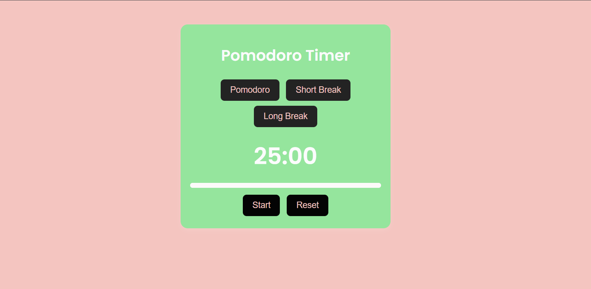

# Pomodoro Timer 

A simple and clean Pomodoro Timer built with HTML, CSS, and JavaScript. It's perfect for staying focused and boosting productivity by using the Pomodoro technique—work for a set time, then take a break!

## Features ✨
- Three modes: **Pomodoro (25 min), Short Break (5 min), and Long Break (15 min)**
- Start and reset buttons to control the timer
- A progress bar to track your session
- Simple, minimalist, and responsive design

## Tech Stack 
- **HTML** 
- **CSS** 
- **JavaScript** 

[pomodoro-timer](https://deeksharamagiri.github.io/pomodoro-timer/)

